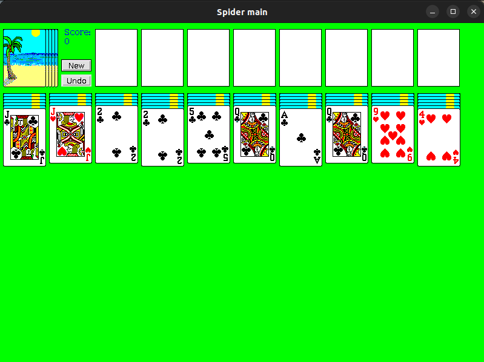

# spider-solitaire
A spider solitaire game written in Java



# Background

This is the game of Spider Solitaire.  I started writing this back in 1996 using Java 1.0.  Originally it was created as a Java Applet which is what Java was mainly used for back then.  Over the years, it has been only slightly modified to also be usable as a Java standalone Swing Application.  Under the covers, though, it is still a Java Applet that uses the ancient Java 1.0 event model.  It is rather amazing that it even still works in 2023.  This game will run as either a standalone Java application, or as an Applet.

# Running standalone
1. clone this repo
2. Install Java 8 on your computer
3. run from a command line:
```bash
$ cd spider-solitaire
$ java -jar lib/spiderapplet-1.0-SNAPSHOT.jar
```

# Running with appletviewer
1. Make sure you can run the game as a standalone app shown above.
2. run it:
```bash
$ cd spider-solitaire
$ appletviewer lib/spider.html
```

# Installing as Ubuntu desktop application
1. Make sure you can run the game as a standalone app shown above.
2. edit `spider.desktop` file to reflect the absolute path of the Exec and Icon keys.
3. edit `runspider.sh` to reflect the absolute path of your installed Java 8
4. install the desktop entry:
```bash
$ cp spider.desktop ~/.local/share/applications/spider.desktop
```
Now, you should be able to find your application in the application menu, and clicking it will launch the Java application using the specified JAR file. The icon you specified should also be displayed in the menu.

# Running as Applet in a browser
Back in the day, this game used be played inside a browser window.  However, modern browsers no longer support the Java plugin necessary for running Java Applets like this.  It might be possible to run this game inside a browser if you are willing to jump through many hoops to find an old browser with a working Java plugin.  If your browser is old enough to support running Java Applets, you should see it running automatically below here:

<embed  id="spiderapplet"
        type="application/x-java-applet;version=1.6"
        archive="lib/spiderapplet-1.0-SNAPSHOT.jar"
        code="com/garyclayburg/spider/Spider.class"
        width=800 height=1200>
</embed>

**Bonus**: If you find a browser that can run this Applet, open an issue and describe how you did it.  What hoops did you jump through?

# Running with Web Start in a browser
At one point, this game was also runnable in a browser using Java Web Start.  It is unlikely your modern browser will know how to do this.

https://github.com/gclayburg/spider-solitaire/blob/master/spider.jnlp

raw version
https://raw.githubusercontent.com/gclayburg/spider-solitaire/master/spider.jnlp

        
        
# Building
```bash
$ ./build.sh
```


